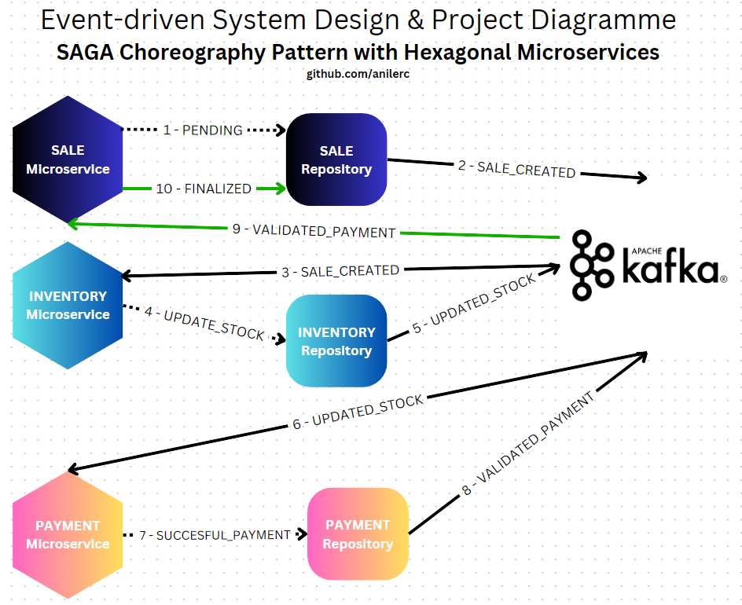
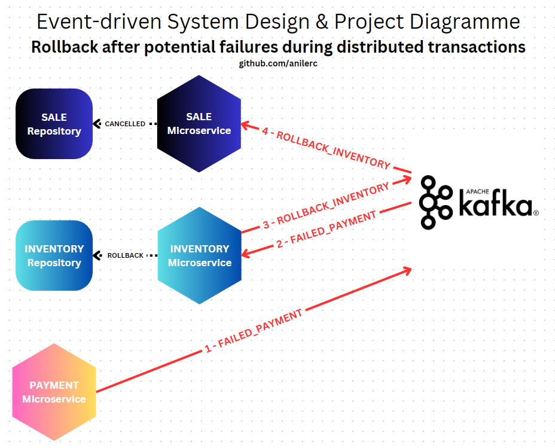

## Choreography-based SAGA Design Pattern with Hexagonal Architecture Implementation with Spring Boot & Apache Kafka

#### Overview & Detailed Explanation

This project showcases my implementation of the choreography-based SAGA design pattern for managing distributed transactions, utilizing Apache Kafka as the event broker. In distributed systems, maintaining data consistency across microservices is crucial, and the SAGA pattern provides a reliable method for achieving this. This README explains the philosophy behind my implementation and includes diagrams and illustrations for clarity.

#### What is SAGA?

Imagine a traditional monolithic application with a single database. Here, managing transactions is straightforward. When you perform a series of operations, they either all succeed or all fail together, maintaining the consistency of your data.

Now, let's shift to a world of distributed microservices, where each microservice is like an independent application with its own database. Here, ensuring that a series of operations across these different services either all succeed or fail together becomes complex. This is where SAGAs come into play.

A SAGA is a sequence of operations or local transactions, each happening within its own microservice. Think of it as a chain of actions where each link (microservice) performs its task and passes the baton to the next. But there's a catch: if one link fails, you need a way to undo the changes made by the previous links to maintain data consistency. This is crucial because in distributed systems, unlike monolithic architectures, there isn't a single point of control or a single database to manage these transactions.

#### Choreography-based SAGA vs Orchestration-based SAGA

Choreography vs. Orchestration
In the choreography approach, each service involved in the SAGA listens for events and decides when and what action to take. There is no central coordinator. This differs from orchestration, where a central coordinator manages the system flow.

#### My System Implementation

In the system I designed, I created three microservices with Ports & Adapters pattern and applied Hexagonal Architecture.

Sale Microservice: The process starts with a new request to the sale microservice, where a sale initiates in a 'PENDING' state.
Sale Created Event: Once the sale is initiated, a 'SALE_CREATED' event is published, signaling that a new sale has entered the system.
Inventory Microservice Subscription to Kafka: The inventory microservice is listening for the 'SALE_CREATED' event.
Update Stock Command: Upon receiving the event, the inventory microservice attempts to update the stock, which is a local transaction within this service.
Updated Stock Event: If the stock update is successful, an 'UPDATED_STOCK' event is published.
Inventory Repository: The inventory repository is updated with the new stock level as part of the inventory microservice's local transaction.
Payment Microservice Subscription: The payment microservice listens for the 'UPDATED_STOCK' event.
Validate Payment Command: Once it receives the event, it processes the payment, which is another local transaction.
Validated Payment Event: Upon successful validation, a 'VALIDATED_PAYMENT' event is published.
Finalization: The sale microservice listens for the 'VALIDATED_PAYMENT' event to finalize the sale.
The SAGA pattern is used here to ensure that each step in the transaction sequence is successful before moving on to the next. If any step fails, compensating transactions or events would be triggered to revert the changes made by the previous steps, thus maintaining data consistency across the microservices. The Apache Kafka event broker enables this pattern by reliably transmitting events between services, which act independently based on the events they receive.

The use of the choreography pattern means there's no central controller dictating the transaction flow. Instead, each microservice knows what to do when it hears certain events.

#### What happens if any of these steps fail?

Just like a straightforward transaction, we traverse back all the services and revert all the changes until that point. Our services always listen to Kafka and they are notified when a failure emerges. I implemented how to respond to these failures too, occurring in the next chains of the flow.

#### Reverting back all the changes: diagramme after possible failure

#### Conclusion

In this project, I honed my event-driven microservices skills by extensively working on Apache Kafka, Spring Boot and Hexagonal Architecture.

##### Thank you for taking the time to read my project.

###### linkedin.com/in/anilerc

###### medium.com/@anilcanerciyes
